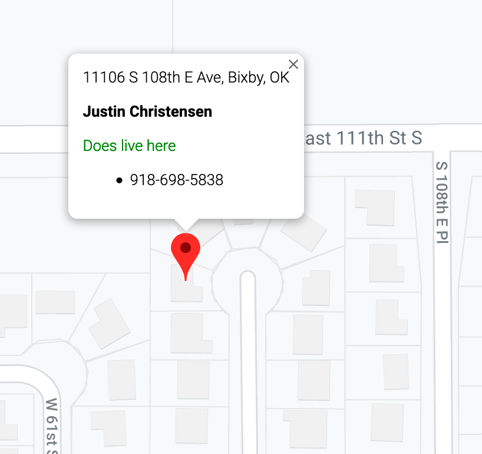

# Gather Map

This is an app to quickly convert territories in the Tulsa Metro area into letter writing and or phone territories while we are all stuck at home.

The app will attempt to find your location and center the map. But you just need to find your territory, zoom in until you see the house outlines (or just switch to Satellite) and click on a house in your territory. A pin will drop there and the address will show up just above it. Once the address shows wait a few more seconds and you should find out the owner's name. If they live there or not and some phone numbers associated with the person living there.

This is all experimental including the phone number lookup system that's being used.

